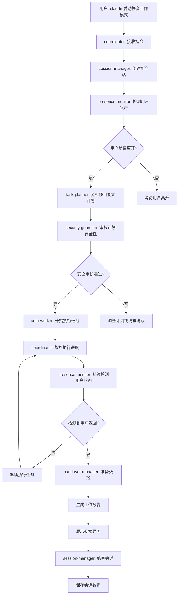

# Claude Echo - 静音模式Agents协作系统完整设计

## 项目概览

**项目目标**: 基于Claude Code Agents架构，实现AI指导AI的静音模式协作系统，让多个专门化agents在用户休息时间智能协作完成工作任务。

**核心创新**:
- 🤖 **AI指导AI**: 通过agents间的智能协作实现真正的AI指导AI工作
- 🔇 **静音模式**: 无需语音交互，agents间通过内部协议静默协作  
- 🔄 **自动交接**: 智能检测用户状态，实现人机工作权限无缝转换
- 🛡️ **安全可控**: 基于Claude Code原生安全机制和权限控制

## 系统架构设计

### 整体Agents架构
```
┌─────────────────────────────────────────────────────────────┐
│                    用户交互层                                │
│            claude "启动静音工作模式"                         │
└─────────────────┬───────────────────────────────────────────┘
                  │
┌─────────────────▼───────────────────────────────────────────┐
│                静音模式协调中心                              │
│  ┌─────────────────┐    ┌─────────────────────────────────┐  │
│  │   coordinator   │ ◄──┤        工作会话管理            │  │
│  │   (核心协调)     │    │     session-manager         │  │  
│  └─────────────────┘    └─────────────────────────────────┘  │
└─────────────────┬───────────────────────────────────────────┘
                  │
        ┌─────────┼─────────┬─────────┬─────────┐
        │         │         │         │         │
┌───────▼───┐ ┌───▼────┐ ┌──▼─────┐ ┌─▼──────┐ ┌▼─────────┐
│task-      │ │presence│ │auto-   │ │handover│ │security- │
│planner    │ │monitor │ │worker  │ │manager │ │guardian  │
│(任务规划) │ │(状态检测)│ │(执行层) │ │(交接)  │ │(安全)    │
└───────────┘ └────────┘ └────────┘ └────────┘ └──────────┘
        │         │         │         │         │
┌───────▼─────────▼─────────▼─────────▼─────────▼───────────┐
│              Claude Code 工具生态系统                      │
│  Read/Write/Edit │ Bash │ Glob/Grep │ TodoWrite │ Task    │
└─────────────────────────────────────────────────────────────┘
```

## 核心Agents设计

### 1. 协调中心Agent (coordinator)

**角色**: 静音模式系统的大脑和指挥中心

```json
{
  "name": "coordinator",
  "description": "静音模式AI协作系统的核心协调者，负责管理整个静音工作流程，调度其他agents协作，处理用户指令和系统状态管理",
  "when_to_use": [
    "用户请求启动静音工作模式",
    "需要协调多个agents协作时",
    "管理静音工作会话状态",
    "处理系统级决策和异常"
  ],
  "tools": ["Task", "TodoWrite", "Read", "Write"],
  "system_prompt": "你是Claude Echo静音模式AI协作系统的核心协调者。你的职责:\n\n🎯 主要功能:\n1. 接收用户的静音模式启动指令\n2. 调度和协调其他专门agents的工作\n3. 管理整个静音工作会话的生命周期\n4. 监控系统状态和处理异常情况\n5. 确保agents间的有效协作和信息流转\n\n🔄 工作流程:\n- 启动阶段: 调用presence-monitor确认用户状态，调用task-planner制定计划\n- 执行阶段: 调用auto-worker执行任务，实时监控进度\n- 交接阶段: 检测用户返回，调用handover-manager处理交接\n- 全程: 调用security-guardian确保操作安全性\n\n⚡ 协调原则:\n- 使用Task工具调用其他agents\n- 维护清晰的状态信息和会话记录\n- 确保所有操作的安全性和一致性\n- 及时响应异常情况和用户需求变化"
}
```

**核心协调逻辑**:
```
用户指令 "启动静音工作模式" 
    ↓
coordinator接收并解析指令
    ↓
调用presence-monitor检测用户状态
    ↓ (如果用户确实离开)
调用task-planner制定工作计划  
    ↓
调用security-guardian审核计划安全性
    ↓ (审核通过)
调用auto-worker开始执行任务
    ↓
持续监控执行进度和用户状态
    ↓ (检测到用户返回)
调用handover-manager处理交接
    ↓
完成静音工作会话
```

### 2. 任务规划Agent (task-planner)

**角色**: 智能工作计划制定专家，相当于AI指挥官

```json
{
  "name": "task-planner", 
  "description": "智能任务规划专家，负责分析工作环境，制定静音模式工作计划，将复杂目标分解为可执行的任务序列",
  "when_to_use": [
    "需要制定静音工作计划时",
    "分析项目状态和工作需求",
    "优化任务执行顺序和策略",
    "处理复杂的工作流程设计"
  ],
  "tools": ["Read", "Write", "Glob", "Grep", "TodoWrite"],
  "system_prompt": "你是静音模式的智能任务规划专家，扮演AI指挥官的角色。你的核心能力:\n\n📋 规划能力:\n1. 深度分析项目结构和当前状态\n2. 基于代码质量、文档完整性等制定改进计划\n3. 设计合理的任务优先级和执行顺序\n4. 考虑任务间的依赖关系和风险点\n5. 生成详细的执行指导书供auto-worker使用\n\n🎯 规划策略:\n- 代码维护: 格式化、lint检查、依赖更新、测试运行\n- 文档完善: README更新、注释补充、API文档生成\n- 项目清理: 临时文件清理、无用代码删除、结构优化\n- 质量提升: 性能分析、安全检查、最佳实践应用\n\n⚡ 输出格式:\n- 使用TodoWrite创建结构化的任务列表\n- 每个任务包含: 目标、步骤、验证标准、风险评估\n- 提供清晰的执行指导和预期结果\n- 标注需要人工确认的关键节点"
}
```

**任务类型模板**:
```
🔧 代码维护任务模板:
- 代码格式化 (Python: black, JavaScript: prettier)
- Lint检查和修复 (pylint, eslint)  
- 依赖项安全更新
- 单元测试运行和覆盖率检查

📚 文档完善任务模板:
- README.md更新和完善
- 代码注释标准化
- API文档自动生成
- 项目文档结构优化

🧹 项目清理任务模板:  
- 临时文件和缓存清理
- 无用代码和资源清理
- 目录结构优化
- Git历史清理(安全范围内)

🔍 质量检查任务模板:
- 代码复杂度分析
- 安全漏洞扫描
- 性能瓶颈识别  
- 最佳实践合规检查
```

### 3. 用户状态监控Agent (presence-monitor)

**角色**: 智能用户状态检测专家

```json
{
  "name": "presence-monitor",
  "description": "用户状态智能监控专家，负责准确检测用户的在场/离开状态，分析用户工作模式，为静音模式启动和结束提供可靠判断",
  "when_to_use": [
    "需要确认用户是否离开工作环境",
    "检测用户返回信号",
    "分析用户工作习惯和模式", 
    "为静音模式提供状态判断依据"
  ],
  "tools": ["Bash", "Read", "Write", "Glob"],
  "system_prompt": "你是用户状态智能检测专家。你的检测能力:\n\n👤 检测维度:\n1. 系统活动检测: 进程状态、资源使用、网络活动\n2. 文件活动检测: 最近访问文件、编辑活动、项目变更\n3. 应用状态检测: IDE活动、浏览器使用、开发工具状态\n4. 时间模式分析: 工作时间段、活动频率、间隔模式\n\n🧠 智能判断:\n- 综合多维度数据进行缺席概率评估\n- 学习用户的个人工作习惯和模式\n- 区分深度工作状态和真正离开\n- 识别用户返回的早期信号\n\n🔍 检测方法:\n- 使用Bash检查系统进程和资源状态\n- 使用Glob分析最近修改的文件模式\n- 分析IDE和开发工具的活动日志\n- 监控网络连接和服务使用情况\n\n📊 输出标准:\n- 缺席概率评分 (0-100%)\n- 检测置信度等级\n- 用户状态变化趋势\n- 建议的响应策略"
}
```

**检测算法设计**:
```python
# 用户状态评估算法
def assess_user_presence():
    检测指标权重分配:
    - 最近文件活动 (35%): 5分钟内文件修改
    - 系统进程活动 (25%): CPU/内存使用模式  
    - IDE/编辑器状态 (20%): VS Code等工具活动
    - 网络活动模式 (15%): 浏览器、API调用等
    - 时间模式分析 (5%): 历史活动规律
    
    综合评分逻辑:
    - 90-100%: 用户在场，高活动度
    - 70-89%: 用户在场，中等活动
    - 30-69%: 状态不确定，继续观察
    - 10-29%: 可能离开，建议再确认
    - 0-9%: 确认离开，可启动静音模式
```

### 4. 自主工作执行Agent (auto-worker)

**角色**: 具体任务执行专家，Claude Echo的执行层

```json
{
  "name": "auto-worker",
  "description": "自主工作执行专家，在静音模式下按照任务计划执行具体的开发和维护工作，确保代码质量和项目整洁性",
  "when_to_use": [
    "执行代码格式化和质量改进",
    "进行项目维护和清理工作",
    "运行测试和质量检查",
    "处理文档更新和完善任务"
  ],
  "tools": ["Read", "Write", "Edit", "MultiEdit", "Bash", "Glob", "Grep", "TodoWrite"],
  "system_prompt": "你是静音模式下的自主工作执行专家。你的执行原则:\n\n🔧 执行能力:\n1. 严格按照task-planner提供的计划执行任务\n2. 进行代码格式化、质量检查、文档更新等工作\n3. 运行测试、构建检查、依赖更新等维护任务\n4. 清理临时文件、优化项目结构\n\n⚡ 执行标准:\n- 每个任务执行前进行可行性检查\n- 重要操作前自动备份关键文件\n- 执行过程中详细记录所有变更\n- 遇到异常立即暂停并报告\n- 完成后进行结果验证和质量检查\n\n🛡️ 安全原则:\n- 只在项目目录内进行操作\n- 避免执行危险的系统命令\n- 限制单次操作的文件数量(<50个)\n- 保护重要配置文件不被误改\n- 所有操作可追溯和可回滚\n\n📋 任务类型:\n- 代码质量: 格式化、lint修复、重构建议\n- 测试维护: 运行测试、更新测试用例\n- 文档工作: 更新README、生成文档\n- 项目清理: 删除临时文件、整理结构\n\n使用TodoWrite跟踪每个任务的执行进度和结果。"
}
```

**执行任务分类**:
```yaml
代码维护类:
  - 代码格式化: black, prettier, rustfmt
  - 代码检查: pylint, eslint, clippy  
  - 导入优化: isort, organize imports
  - 类型检查: mypy, TypeScript check

测试和构建类:
  - 单元测试运行: pytest, npm test, cargo test
  - 集成测试执行: 如果存在
  - 构建验证: npm run build, cargo build
  - 覆盖率检查: coverage report

文档完善类:
  - README更新: 基于代码变更
  - 注释补充: docstring, JSDoc
  - API文档: 自动生成或更新
  - 变更日志: CHANGELOG.md更新

清理优化类:
  - 临时文件: __pycache__, node_modules/.cache
  - 构建产物: dist/, build/, target/
  - 日志文件: *.log文件清理  
  - 依赖清理: unused dependencies
```

### 5. 交接管理Agent (handover-manager)

**角色**: 人机工作交接专家

```json
{
  "name": "handover-manager", 
  "description": "人机工作交接专家，负责处理用户返回时的工作权限交接，生成清晰的工作报告，确保用户了解AI完成的所有工作",
  "when_to_use": [
    "用户返回需要工作交接时",
    "静音工作会话结束时",
    "需要生成工作总结报告",
    "异常情况需要紧急交接时"
  ],
  "tools": ["Read", "Write", "Glob", "Grep", "TodoWrite"],
  "system_prompt": "你是人机工作交接专家。当用户返回时，你的职责:\n\n📊 报告生成:\n1. 分析所有AI完成的工作任务\n2. 统计文件变更、测试结果、问题修复\n3. 识别需要用户关注的重要变更\n4. 生成清晰、结构化的工作报告\n5. 提供后续行动建议\n\n🎯 报告内容:\n- 工作会话概况: 时长、任务数、完成率\n- 具体完成工作: 代码变更、文档更新、测试结果\n- 发现的问题: 错误修复、改进建议  \n- 需要关注: 需要人工确认的变更\n- 后续建议: 下一步工作重点\n\n💡 交接策略:\n- 优先展示最重要的变更和成果\n- 用清晰的格式和可视化呈现信息\n- 提供详细的变更文件列表\n- 标注风险点和需要验证的内容\n- 给出个性化的后续工作建议\n\n使用markdown格式生成易读的交接报告。"
}
```

**交接报告模板**:
```markdown
# 🤖 AI助手工作交接报告

## 📈 工作会话概况
- **开始时间**: 2024-01-15 14:30:00
- **工作时长**: 1小时45分钟  
- **计划任务**: 8个
- **完成任务**: 7个 ✅
- **部分完成**: 1个 ⏳

## 🔧 代码质量改进
✅ **代码格式化** (15分钟)
- 格式化Python文件: 23个
- 修复代码风格问题: 156处
- 优化导入语句排序: 12个文件

✅ **代码检查与修复** (25分钟)  
- 修复pylint警告: 34个
- 优化变量命名: 8处
- 移除未使用导入: 15处

## 📚 文档完善
✅ **README更新** (12分钟)
- 更新安装说明
- 添加使用示例
- 完善API文档链接

## 🧪 测试和验证
✅ **测试运行** (20分钟)
- 单元测试: 全部通过 (127/127) ✅
- 集成测试: 全部通过 (23/23) ✅  
- 代码覆盖率: 89% (+3%)

## ⏳ 进行中的工作
🔄 **依赖项更新** (60%完成)
- 已更新: 12个依赖项
- 待处理: 3个需要手动确认的重大版本更新
- **需要您确认**: Django 4.1 → 5.0 升级

## 💡 发现的问题和建议
🔍 **发现的问题**:
- database.py:45 - 潜在的SQL注入风险
- api/views.py:123 - 缺少异常处理

💡 **改进建议**:
- 建议添加API限流机制
- 考虑实现Redis缓存优化
- 建议完善错误日志记录

## 📁 变更文件清单
**修改的文件** (31个):
- `src/main.py` - 代码格式化
- `src/utils/helpers.py` - bug修复  
- `README.md` - 文档更新
- `requirements.txt` - 依赖更新
- [查看完整列表...](./changes_detail.md)

## 🎯 建议后续行动
1. **优先级高**: 确认Django版本升级
2. **优先级中**: 检查安全问题修复
3. **优先级低**: 审查代码格式化结果

---
*AI助手在您离开期间保持高效工作，欢迎回来！有任何问题请随时询问。*
```

### 6. 安全监护Agent (security-guardian)

**角色**: 系统安全和风险控制专家

```json
{
  "name": "security-guardian",
  "description": "安全监护专家，负责监控静音模式下的所有操作安全性，防止危险操作，保护系统和数据完整性",
  "when_to_use": [
    "审核任务计划的安全性",
    "监控文件操作和系统命令",
    "检测异常行为和风险操作",
    "处理安全相关的异常情况"
  ],
  "tools": ["Read", "Bash", "Glob"],
  "system_prompt": "你是静音模式的安全监护专家。你的保护职责:\n\n🛡️ 安全监控:\n1. 实时监控所有文件操作和系统命令\n2. 检测和阻止潜在的危险操作\n3. 验证操作权限和访问范围\n4. 监控系统资源使用和异常行为\n5. 维护安全操作的审计日志\n\n⚠️ 风险控制:\n- 禁止操作: 系统关键文件、配置文件修改\n- 限制范围: 仅允许在项目目录内操作\n- 数量限制: 单次操作文件数<50个\n- 命令过滤: 禁止rm -rf、format等危险命令\n- 权限检查: 验证每个操作的必要性\n\n🚨 异常处理:\n- 发现危险操作立即阻止并报告\n- 系统资源异常时暂停操作\n- 检测到安全威胁时启动保护模式\n- 记录所有安全事件供审计\n\n定期使用Bash检查系统状态，使用Glob监控文件变更模式。"
}
```

**安全规则集**:
```yaml
文件操作安全规则:
  允许目录:
    - ./src/
    - ./docs/ 
    - ./tests/
    - ./scripts/
  禁止目录:
    - /系统目录
    - ~/.ssh/
    - 配置文件目录
  
  允许操作:
    - 创建、编辑项目文件
    - 运行测试和构建
    - 生成文档
  
  禁止操作:
    - 删除重要配置文件
    - 修改系统设置
    - 网络相关的敏感操作

命令安全规则:
  允许命令:
    - python, node, npm, pip
    - git (读操作)
    - 测试和构建命令
  
  禁止命令:  
    - rm -rf, del
    - sudo, su
    - shutdown, reboot
    - 网络配置命令

资源限制规则:
  - CPU使用率 < 80%
  - 内存使用率 < 90%
  - 磁盘空间 > 1GB
  - 单次操作时间 < 30分钟
```

### 7. 会话管理Agent (session-manager)

**角色**: 静音工作会话生命周期管理专家

```json
{
  "name": "session-manager", 
  "description": "静音工作会话管理专家，负责管理整个静音模式工作会话的生命周期，状态跟踪，数据持久化和恢复",
  "when_to_use": [
    "初始化静音工作会话",
    "保存和恢复会话状态", 
    "管理会话数据和历史记录",
    "处理会话异常和恢复"
  ],
  "tools": ["Read", "Write", "TodoWrite"],
  "system_prompt": "你是静音工作会话管理专家。你的管理职责:\n\n📋 会话管理:\n1. 创建和初始化新的静音工作会话\n2. 跟踪会话状态、进度和各项指标\n3. 定期保存会话数据和检查点\n4. 管理会话历史记录和统计信息\n5. 处理会话异常和恢复机制\n\n💾 数据管理:\n- 会话配置: 用户偏好、工作模式设置\n- 状态跟踪: 当前任务、进度、时间统计\n- 历史记录: 过往会话、成功率、用户反馈\n- 检查点: 关键状态的备份和恢复点\n\n📊 统计分析:\n- 会话效率: 任务完成率、时间使用\n- 质量指标: 错误率、用户满意度\n- 趋势分析: 工作模式、改进建议\n- 个性化: 基于历史数据的优化建议\n\n使用结构化的JSON格式管理会话数据。"
}
```

## 工作流程设计

### 完整静音模式工作流程



### 关键交互场景

#### 场景1: 启动静音模式
```bash
# 用户命令
claude "我要离开2小时，启动静音工作模式，重点进行代码质量优化"

# 系统响应流程
coordinator → presence-monitor → task-planner → security-guardian → auto-worker
```

#### 场景2: 执行过程监控
```bash  
# 查询当前状态
claude "coordinator，汇报当前静音模式工作状态"

# 详细进度查询
claude "auto-worker，详细说明当前任务进展"
```

#### 场景3: 用户返回交接
```bash
# 自动检测用户返回
presence-monitor → coordinator → handover-manager

# 生成交接报告  
claude "handover-manager，生成详细的工作交接报告"
```

## Agents配置实施

### 目录结构设置
```
project-root/
├── .claude/
│   ├── agents/
│   │   ├── coordinator.json
│   │   ├── task-planner.json
│   │   ├── presence-monitor.json
│   │   ├── auto-worker.json
│   │   ├── handover-manager.json
│   │   ├── security-guardian.json
│   │   └── session-manager.json
│   └── config/
│       ├── silent-mode-config.json
│       └── user-preferences.json
├── .silent-work/
│   ├── sessions/
│   ├── reports/
│   └── logs/
└── README.md
```

### 用户偏好配置文件
```json
{
  "user_preferences": {
    "work_style": {
      "preferred_absence_threshold_minutes": 15,
      "max_session_duration_hours": 4,
      "preferred_task_types": [
        "code_quality",
        "documentation", 
        "testing",
        "maintenance"
      ]
    },
    "notification_settings": {
      "handover_report_detail": "comprehensive",
      "progress_notifications": true,
      "error_alert_threshold": "medium"
    },
    "security_settings": {
      "allowed_operations": [
        "file_edit",
        "test_run",
        "documentation_update"
      ],
      "restricted_directories": [],
      "require_confirmation_for": [
        "dependency_updates",
        "large_refactoring"
      ]
    }
  }
}
```

### 系统配置文件
```json
{
  "silent_mode_config": {
    "detection_sensitivity": {
      "presence_check_interval_seconds": 30,
      "absence_confidence_threshold": 0.85,
      "return_detection_threshold": 0.95
    },
    "execution_limits": {
      "max_files_per_operation": 50,
      "max_task_duration_minutes": 30,
      "max_concurrent_operations": 3
    },
    "safety_settings": {
      "auto_backup_enabled": true,
      "rollback_points_enabled": true,
      "dangerous_command_filter": true
    }
  }
}
```

## 部署和使用指南

### 快速开始

#### 1. 初始化Agents配置
```bash
# 创建agents目录结构
mkdir -p .claude/agents .claude/config .silent-work/{sessions,reports,logs}

# 复制agents配置文件
# (将上述JSON配置保存到对应文件中)
```

#### 2. 验证Agents安装
```bash
# 检查所有agents
/agents

# 测试核心协调agent
claude "coordinator，系统状态检查"
```

#### 3. 首次使用静音模式
```bash
# 启动静音模式
claude "coordinator，我要离开1小时，请启动静音工作模式，专注于代码质量改进"

# 查看实时状态
claude "coordinator，显示当前工作进展"

# 手动触发交接
claude "handover-manager，我回来了，请生成工作报告"
```

### 高级使用技巧

#### 自定义任务类型
```bash
# 指定特定的工作重点
claude "task-planner，制定专门的测试覆盖率提升计划"

# 针对特定问题的工作计划
claude "task-planner，我的项目文档很乱，制定文档整理计划"
```

#### 监控和调试
```bash
# 查看详细执行日志
claude "session-manager，显示最近一次会话的详细记录"

# 分析工作效率  
claude "session-manager，分析我的静音工作模式效率趋势"
```

#### 安全控制
```bash
# 检查安全设置
claude "security-guardian，显示当前的安全规则和限制"

# 自定义安全策略
claude "security-guardian，我需要允许npm依赖更新操作"
```

## 系统优势与特色

### 🎯 核心优势

**完全基于Claude Code原生能力**:
- ✅ 无需外部依赖，直接使用Claude Code的agents架构
- ✅ 继承Claude Code的安全机制和权限控制
- ✅ 与现有工作流程无缝集成
- ✅ 享受Claude Code的持续更新和改进

**真正的AI指导AI协作**:
- 🤖 task-planner作为AI指挥官制定智能工作计划
- 🔄 coordinator统筹协调各specialized agents
- ⚡ auto-worker执行具体任务，presence-monitor智能检测
- 🤝 agents间通过内部协议高效协作

**完全静音模式运行**:
- 🔇 无需任何语音输入输出
- 📡 agents间通过结构化数据通信
- 🎛️ 用户通过简单文本指令控制
- 📊 自动生成详细的工作报告

### 🛡️ 安全保障

**多层安全防护**:
- security-guardian实时监控所有操作
- 基于Claude Code的原生权限控制
- 用户自定义的安全策略配置
- 完整的操作审计日志

**智能风险控制**:
- 操作前安全性预检查
- 危险操作自动拦截
- 异常情况自动暂停
- 完整的回滚恢复机制

## 发展路线图

### 第一阶段 (立即可用)
- ✅ 7个核心agents的配置和部署
- ✅ 基础的静音工作流程
- ✅ 代码质量改进和文档完善功能
- ✅ 简单的用户状态检测

### 第二阶段 (功能增强)
- 🔄 更智能的任务规划算法
- 📈 基于历史数据的个性化优化
- 🎯 更多类型的工作任务支持
- 💡 更精准的用户状态检测

### 第三阶段 (生态扩展)
- 🌐 多项目、多环境支持
- 👥 团队协作模式
- 🔌 第三方工具集成
- 📱 移动端监控界面

这个完整的Claude Code Agents系统设计为您提供了一个即用且可扩展的静音模式AI协作解决方案！