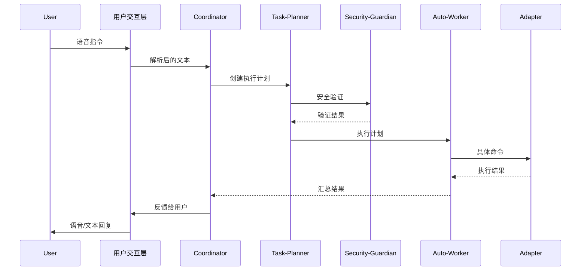

# 系统架构设计

## 🏗️ 整体架构概述

本项目采用 **分层架构 + Agents 协作模式**，实现高度模块化和可扩展的语音助手系统。

## 📊 分层架构设计

### 1. 用户交互层 (User Interface Layer)

**职责**: 处理用户输入输出，支持语音和文本交互

**组件**:
- 语音识别引擎 (Whisper)
- 语音合成引擎 (TTS)
- 命令行界面 (CLI)
- 可选的图形界面 (GUI)

**技术实现**:
```python
class VoiceInterface:
    def __init__(self):
        self.speech_recognizer = WhisperEngine()
        self.speech_synthesizer = TTSEngine()
        self.cli = CLIInterface()
    
    async def listen(self) -> str:
        """监听并识别语音输入"""
        pass
    
    async def speak(self, text: str):
        """语音输出"""
        pass
```

### 2. 智能中枢层 (Intelligence Hub Layer)

**职责**: 核心智能决策，包含7个核心 Agents

**核心 Agents**:

#### 2.1 Coordinator (协调中心)
```python
class Coordinator:
    """整体协调和任务分发"""
    
    async def process_request(self, user_input: str):
        """处理用户请求的主入口"""
        # 1. 解析用户意图
        intent = await self.parse_intent(user_input)
        
        # 2. 安全检查
        if not await self.security_guardian.validate_request(intent):
            return SecurityError("操作被拒绝")
        
        # 3. 任务规划
        plan = await self.task_planner.create_plan(intent)
        
        # 4. 执行协调
        return await self.auto_worker.execute_plan(plan)
```

#### 2.2 Task-Planner (任务规划)
```python
class TaskPlanner:
    """智能任务分解和规划"""
    
    async def create_plan(self, intent: Intent) -> ExecutionPlan:
        """将用户意图转换为执行计划"""
        # 1. 意图分析
        # 2. 任务分解
        # 3. 依赖分析
        # 4. 执行序列规划
        pass
    
    async def optimize_plan(self, plan: ExecutionPlan) -> ExecutionPlan:
        """优化执行计划"""
        pass
```

#### 2.3 Presence-Monitor (状态监控)
```python
class PresenceMonitor:
    """用户状态和环境检测"""
    
    async def is_user_present(self) -> bool:
        """检测用户是否在线"""
        pass
    
    async def get_current_context(self) -> Context:
        """获取当前环境上下文"""
        return Context(
            active_application=self.detect_active_app(),
            current_file=self.get_current_file(),
            screen_content=self.analyze_screen(),
            user_focus=self.analyze_user_focus()
        )
```

#### 2.4 Auto-Worker (自主执行)
```python
class AutoWorker:
    """具体任务执行"""
    
    async def execute_plan(self, plan: ExecutionPlan) -> ExecutionResult:
        """执行任务计划"""
        results = []
        for task in plan.tasks:
            # 1. 选择适配器
            adapter = self.adapter_manager.get_adapter(task.target)
            
            # 2. 执行任务
            result = await adapter.execute_command(task.command, task.parameters)
            results.append(result)
            
            # 3. 状态更新
            await self.update_execution_status(task, result)
        
        return ExecutionResult(results)
```

#### 2.5 Security-Guardian (安全监护)
```python
class SecurityGuardian:
    """安全控制和风险管理"""
    
    async def validate_request(self, intent: Intent) -> bool:
        """验证请求安全性"""
        # 1. 权限检查
        # 2. 危险操作检测
        # 3. 用户确认机制
        # 4. 审计日志记录
        pass
    
    async def require_user_confirmation(self, operation: str) -> bool:
        """需要用户确认的操作"""
        pass
```

#### 2.6 Handover-Manager (交接管理)
```python
class HandoverManager:
    """人机交接处理"""
    
    async def prepare_handover(self, results: ExecutionResult):
        """准备交接用户"""
        # 1. 结果摘要
        # 2. 问题汇总
        # 3. 后续建议
        pass
    
    async def handle_interruption(self, user_input: str):
        """处理用户打断"""
        pass
```

#### 2.7 Session-Manager (会话管理)
```python
class SessionManager:
    """会话生命周期和状态管理"""
    
    async def start_session(self, user_id: str):
        """开始会话"""
        pass
    
    async def save_session_state(self):
        """保存会话状态"""
        pass
    
    async def restore_session_state(self):
        """恢复会话状态"""
        pass
```

### 3. 适配器层 (Adapter Layer)

**职责**: 具体工具和服务的抽象接口

**基础适配器接口**:
```python
from abc import ABC, abstractmethod
from typing import Dict, Any, List

class BaseAdapter(ABC):
    """所有适配器的基础接口"""
    
    @property
    @abstractmethod
    def adapter_id(self) -> str:
        """适配器唯一标识"""
        pass
    
    @property
    @abstractmethod
    def supported_commands(self) -> List[str]:
        """支持的命令列表"""
        pass
    
    @abstractmethod
    async def execute_command(self, command: str, parameters: Dict[str, Any]) -> CommandResult:
        """执行命令"""
        pass
    
    @abstractmethod
    def is_available(self) -> bool:
        """检查适配器是否可用"""
        pass
    
    @abstractmethod
    def get_current_state(self) -> Dict[str, Any]:
        """获取当前状态"""
        pass
    
    @abstractmethod
    def get_command_suggestions(self, context: Dict[str, Any]) -> List[str]:
        """基于上下文提供命令建议"""
        pass
```

**主要适配器类型**:
- **Claude Code 适配器**: 文件操作、代码生成、工具调用
- **系统操作适配器**: 鼠标、键盘、窗口、应用程序控制
- **IDE 适配器**: VS Code、IntelliJ、Vim 等集成
- **办公软件适配器**: Office、浏览器、记事本等

### 4. 执行层 (Execution Layer)

**职责**: 实际的系统调用和外部服务交互

**组件**:
- 系统 API 调用
- 外部服务接口
- 文件系统操作
- 网络通信

## 🔄 工作流程

### 典型交互流程



### 静音模式工作流程

```python
async def silent_mode_workflow():
    """静音模式工作流程"""
    # 1. 用户缺席检测
    if await presence_monitor.is_user_absent():
        
        # 2. 获取待执行任务
        pending_tasks = await session_manager.get_pending_tasks()
        
        # 3. 安全评估
        safe_tasks = []
        for task in pending_tasks:
            if await security_guardian.is_safe_for_autonomous_execution(task):
                safe_tasks.append(task)
        
        # 4. 自主执行
        results = []
        for task in safe_tasks:
            result = await auto_worker.execute_task(task)
            results.append(result)
        
        # 5. 准备交接
        if await presence_monitor.is_user_returning():
            await handover_manager.prepare_handover(results)
```

## 📊 数据流架构

### 上下文数据流
```python
class Context:
    """系统上下文信息"""
    user_id: str
    session_id: str
    current_app: str
    current_file: str
    screen_content: str
    recent_commands: List[str]
    user_preferences: Dict[str, Any]
    timestamp: datetime
```

### 执行计划数据结构
```python
class ExecutionPlan:
    """执行计划"""
    plan_id: str
    intent: Intent
    tasks: List[Task]
    dependencies: List[Dependency]
    estimated_duration: timedelta
    risk_level: RiskLevel
```

## 🔧 扩展性设计

### 1. 插件化适配器系统
- 热插拔支持
- 标准化接口
- 自动发现机制

### 2. 配置驱动架构
- YAML 配置文件
- 环境变量支持
- 运行时配置更新

### 3. 多用户支持
- 用户配置隔离
- 权限管理
- 个性化学习

## 🛡️ 安全架构

### 安全层次
1. **输入验证**: 用户输入的安全检查
2. **权限控制**: 基于角色的访问控制
3. **操作审计**: 所有操作的日志记录
4. **风险评估**: 操作风险的实时评估

### 安全策略
```yaml
security:
  risk_levels:
    low: ["read_file", "list_directory"]
    medium: ["edit_file", "run_command"]
    high: ["delete_file", "system_command"]
    critical: ["format_drive", "network_access"]
  
  policies:
    silent_mode: ["low", "medium"]  # 静音模式允许的风险级别
    user_confirmation: ["high", "critical"]  # 需要确认的操作
```

这个架构设计确保了系统的可扩展性、安全性和可维护性，为后续的功能开发奠定了坚实基础。

---

## 🏗️ 架构实现详情

### 核心框架实现

#### 1. BaseAdapter 抽象基类

所有适配器的标准化接口，位于 `src/core/base_adapter.py`：

```python
class BaseAdapter(ABC):
    """所有适配器的抽象基类"""
    
    @property
    @abstractmethod
    def adapter_id(self) -> str:
        """适配器唯一标识"""
        pass
    
    @abstractmethod
    async def execute_command(self, command: str, parameters: Dict[str, Any], 
                            context: Optional[Context] = None) -> CommandResult:
        """执行命令的核心方法"""
        pass
    
    @abstractmethod
    async def initialize(self) -> bool:
        """初始化适配器"""
        pass
    
    @abstractmethod
    async def cleanup(self) -> None:
        """清理资源"""
        pass
```

**核心特性**:
- 异步执行模型
- 统一错误处理
- 健康检查机制
- 生命周期管理
- 弱引用支持防止内存泄漏

#### 2. AdapterManager 适配器管理器

动态适配器加载和管理，位于 `src/core/adapter_manager.py`：

```python
class AdapterManager:
    """适配器生命周期和执行管理"""
    
    async def register_adapter(self, adapter_class: Type[BaseAdapter]) -> bool:
        """注册新的适配器类"""
        pass
    
    async def execute_command(self, command: str, parameters: Dict[str, Any]) -> CommandResult:
        """路由命令到合适的适配器"""
        pass
    
    async def discover_adapters(self) -> int:
        """自动发现和加载适配器"""
        pass
```

**核心特性**:
- 热插拔适配器支持
- 自动适配器发现
- 命令路由和负载均衡
- 健康监控和故障恢复
- 并发执行支持

#### 3. ConfigManager 配置管理系统

YAML 配置管理，位于 `src/core/config_manager.py`：

```python
class ConfigManager:
    """集中化配置管理"""
    
    def get(self, key: str, default: Any = None) -> Any:
        """获取配置值，支持环境变量覆盖"""
        pass
    
    def get_typed(self, key: str, schema: type) -> Any:
        """类型化配置获取，带验证"""
        pass
    
    async def reload_config(self) -> None:
        """热重载配置文件"""
        pass
```

**核心特性**:
- YAML 文件支持
- 环境变量覆盖
- Pydantic 模型验证
- 热重载配置文件
- 配置变更回调

#### 4. EventSystem 事件驱动系统

异步事件通信，位于 `src/core/event_system.py`：

```python
class EventSystem:
    """异步事件驱动通信系统"""
    
    async def emit(self, event: Event) -> None:
        """发送事件"""
        pass
    
    def subscribe(self, event_types: List[str], handler: Callable) -> str:
        """订阅事件"""
        pass
    
    async def replay_events(self, event_filter: EventFilter) -> int:
        """重放历史事件"""
        pass
```

**核心特性**:
- 模式匹配订阅
- 事件历史和重放
- 错误处理和重试
- 性能监控
- 优先级处理

### 分层架构接口

#### Layer 基础接口

位于 `src/core/layers.py`：

```python
class BaseLayer(ABC):
    """所有架构层的基类"""
    
    @abstractmethod
    async def initialize(self) -> bool:
        pass
    
    @abstractmethod
    async def health_check(self) -> bool:
        pass
    
    async def send_message(self, target_layer: str, message_type: str, 
                         payload: Dict[str, Any]) -> None:
        """层间消息通信"""
        pass
```

#### 四层架构实现

1. **UserInterfaceLayer**: 用户交互处理
2. **IntelligenceHubLayer**: AI 决策中心
3. **AdapterLayer**: 适配器管理
4. **ExecutionLayer**: 系统执行

### 主架构协调器

位于 `src/core/architecture.py`：

```python
class ClaudeVoiceAssistant:
    """4层架构主协调器"""
    
    async def process_user_input(self, user_input: str) -> str:
        """用户输入的完整处理流程"""
        # Layer 1: 解析输入
        intent = await ui_layer.process_input(user_input)
        
        # Layer 2: AI 规划
        plan = await hub_layer.create_execution_plan(intent)
        
        # Layer 3: 执行协调
        results = await hub_layer.coordinate_execution(plan)
        
        # Layer 4: 结果展示
        await ui_layer.present_results(results)
```

## 🔧 配置系统架构

### 配置文件结构

```yaml
# config/default.yaml
system:
  log_level: INFO
  environment: development
  
adapters:
  claude_code:
    enabled: true
    priority: 100
    timeout: 30.0
    
security:
  risk_levels:
    low: ["read_file", "list_directory"]
    medium: ["edit_file", "run_command"]
    high: ["delete_file", "system_command"]
    critical: ["format_drive", "shutdown_system"]
  
  policies:
    silent_mode: ["low", "medium"]
    user_confirmation: ["high", "critical"]
```

### 环境变量覆盖

```bash
# 任何配置都可以通过环境变量覆盖
CLAUDE_ECHO_SYSTEM_LOG_LEVEL=DEBUG
CLAUDE_ECHO_ADAPTERS_CLAUDE_CODE_TIMEOUT=60.0
```

## 📊 类型系统设计

### 核心数据类型

位于 `src/core/types.py`：

```python
class Intent(BaseModel):
    """用户意图结构"""
    intent_id: str
    user_input: str
    intent_type: str
    confidence: float
    parameters: Dict[str, Any]

class ExecutionPlan(BaseModel):
    """执行计划结构"""
    plan_id: str
    intent: Intent
    tasks: List[Task]
    risk_level: RiskLevel

class CommandResult(BaseModel):
    """命令执行结果"""
    success: bool
    data: Optional[Dict[str, Any]]
    error: Optional[str]
    execution_time: Optional[float]
```

### 风险级别枚举

```python
class RiskLevel(Enum):
    LOW = "low"
    MEDIUM = "medium"
    HIGH = "high"
    CRITICAL = "critical"
```

## 🔄 异步执行模式

### 事件驱动架构

```python
# 事件发送示例
await event_system.emit(Event(
    event_type="adapter.command_executed",
    data={"adapter_id": "claude_code", "command": "read_file"},
    source="adapter_manager"
))

# 事件订阅示例
event_system.subscribe(
    ["adapter.*", "layer.message.*"],
    handle_adapter_events,
    priority=100
)
```

### 并发执行支持

```python
# 并行执行多个任务
results = await asyncio.gather(
    *[adapter_manager.execute_command(task.command, task.parameters) 
      for task in plan.tasks],
    return_exceptions=True
)
```

## 📁 项目结构详情

```
src/
├── __init__.py              # 包初始化
├── core/                    # 核心框架
│   ├── __init__.py
│   ├── base_adapter.py      # 适配器基类
│   ├── adapter_manager.py   # 适配器管理器
│   ├── config_manager.py    # 配置管理
│   ├── event_system.py      # 事件系统
│   ├── layers.py            # 层接口定义
│   ├── types.py             # 类型定义
│   └── architecture.py      # 主架构协调器
├── adapters/                # 适配器实现
│   └── __init__.py
├── agents/                  # 智能代理
│   └── __init__.py
├── speech/                  # 语音处理
│   └── __init__.py
└── utils/                   # 工具函数
    └── __init__.py
```

## 🛡️ 安全架构详情

### 多层安全验证

1. **输入层验证**: 用户输入的格式和内容检查
2. **意图层验证**: AI 理解后的安全性评估
3. **执行层验证**: 具体操作的权限检查
4. **审计层记录**: 所有操作的完整日志

### 风险评估流程

```python
async def assess_risk(self, plan: ExecutionPlan) -> ExecutionPlan:
    """风险评估实现"""
    for task in plan.tasks:
        # 检查命令风险级别
        risk = self.security_config.get_command_risk(task.command)
        task.risk_level = risk
        
        # 检查是否需要用户确认
        if risk in ["high", "critical"]:
            plan.requires_user_confirmation = True
    
    return plan
```

## 🔮 扩展性设计

### 插件化适配器

```python
# 新适配器只需继承 BaseAdapter
class MyCustomAdapter(BaseAdapter):
    @property
    def adapter_id(self) -> str:
        return "my_custom_adapter"
    
    async def execute_command(self, command: str, parameters: Dict[str, Any]) -> CommandResult:
        # 自定义实现
        pass
```

### 热插拔支持

- 适配器可以在运行时动态加载/卸载
- 配置文件支持热重载
- 事件系统支持动态订阅/取消订阅

---

## 📋 架构决策记录 (ADR)

### ADR-001: 分层架构模式选择

**状态**: 已接受  
**日期**: 2024-01-XX

**背景**: 需要设计一个可扩展、可维护的语音助手架构。

**决策**: 采用4层架构模式
- 用户交互层: 处理UI/语音
- 智能中枢层: AI决策逻辑  
- 适配器层: 系统集成抽象
- 执行层: 具体系统操作

**结果**: 
- ✅ 清晰的职责分离
- ✅ 易于测试和维护
- ✅ 支持热插拔组件

### ADR-002: 异步编程模式

**状态**: 已接受  
**日期**: 2024-01-XX

**背景**: 语音助手需要处理并发请求和长时间运行的任务。

**决策**: 全面采用 asyncio 异步编程模式

**结果**:
- ✅ 高并发支持
- ✅ 非阻塞执行
- ✅ 更好的资源利用率

### ADR-003: 事件驱动通信

**状态**: 已接受
**日期**: 2024-01-XX

**背景**: 各层和组件之间需要松耦合的通信机制。

**决策**: 使用事件驱动架构进行组件间通信

**结果**:
- ✅ 松耦合设计
- ✅ 易于扩展和测试
- ✅ 支持事件历史和重放