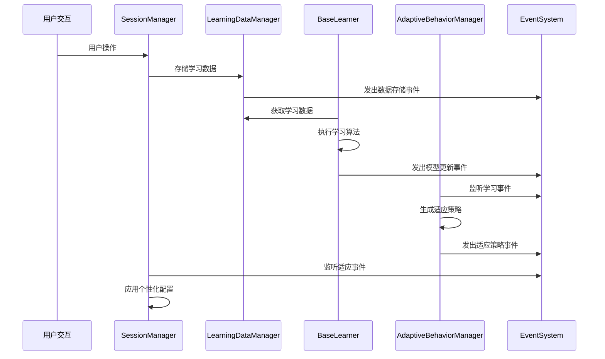

# Claude Echo 第四阶段智能学习系统架构文档

## 概述

本文档描述了Claude Echo智能语音助手第四阶段的智能学习系统架构设计。该系统基于现有的事件驱动架构，提供多用户学习数据隔离、插件化学习算法、自适应行为优化等核心功能。

## 架构设计目标

### 核心目标
- **智能化**: 通过机器学习技术实现系统自适应优化
- **个性化**: 为每个用户提供个性化的交互体验
- **隐私保护**: 确保用户数据的安全和隐私
- **可扩展性**: 支持新的学习算法和适应策略的插件化扩展
- **性能优化**: 基于学习insights自动优化系统性能

### 技术要求
- 基于现有架构扩展，保持向后兼容性
- 分层架构设计，清晰的职责分离
- 插件化学习算法支持
- 异步处理和事件驱动通信
- 多用户数据隔离和安全性

## 整体架构

### 系统层次结构

```
┌─────────────────────────────────────────────────────────────┐
│                    Learning System Layer                    │
├─────────────────────────────────────────────────────────────┤
│  ┌─────────────────┐  ┌─────────────────┐  ┌──────────────┐ │
│  │  AdaptiveBehavior│  │   BaseLearner   │  │  Learning    │ │
│  │    Manager      │  │   Algorithms    │  │  Events      │ │
│  └─────────────────┘  └─────────────────┘  └──────────────┘ │
├─────────────────────────────────────────────────────────────┤
│                    Data Management Layer                    │
├─────────────────────────────────────────────────────────────┤
│  ┌─────────────────┐  ┌─────────────────┐  ┌──────────────┐ │
│  │ LearningData    │  │   UserProfile   │  │   Privacy    │ │
│  │   Manager       │  │   Management    │  │  Protection  │ │
│  └─────────────────┘  └─────────────────┘  └──────────────┘ │
├─────────────────────────────────────────────────────────────┤
│                  Existing Agent System                     │
├─────────────────────────────────────────────────────────────┤
│  ┌─────────────────┐  ┌─────────────────┐  ┌──────────────┐ │
│  │ SessionManager  │  │ HandoverManager │  │   7 Agents   │ │
│  │   (Extended)    │  │                 │  │    System    │ │
│  └─────────────────┘  └─────────────────┘  └──────────────┘ │
├─────────────────────────────────────────────────────────────┤
│                   Core Infrastructure                      │
├─────────────────────────────────────────────────────────────┤
│  ┌─────────────────┐  ┌─────────────────┐  ┌──────────────┐ │
│  │   EventSystem   │  │  ConfigManager  │  │   Storage    │ │
│  │                 │  │                 │  │   Systems    │ │
│  └─────────────────┘  └─────────────────┘  └──────────────┘ │
└─────────────────────────────────────────────────────────────┘
```

## 核心组件设计

### 1. BaseLearner - 学习算法基础框架

#### 设计理念
- 提供统一的学习算法接口
- 支持多种学习模式（在线学习、批处理、强化学习等）
- 集成事件系统进行状态通知
- 标准化的模型持久化和版本管理

#### 关键特性
```python
class BaseLearner(ABC):
    # 支持的学习模式
    - ONLINE: 实时学习
    - BATCH: 批处理学习
    - REINFORCEMENT: 强化学习
    - SUPERVISED: 监督学习
    - UNSUPERVISED: 无监督学习
    
    # 生命周期管理
    - initialize(): 初始化学习器
    - learn(): 主要学习接口
    - shutdown(): 优雅关闭
    
    # 模型管理
    - _save_model(): 保存模型
    - _load_model(): 加载模型
    - get_insights(): 获取学习insights
```

#### 插件化设计
```python
# 学习算法注册机制
@LearnerRegistry.register("user_preference_learner")
class UserPreferenceLearner(BaseLearner):
    @property
    def learner_type(self) -> str:
        return "user_preference_learner"
    
    # 实现学习逻辑
    async def _learn_from_data(self, data, context):
        # 用户偏好学习算法实现
        pass
```

### 2. LearningDataManager - 学习数据管理

#### 数据隔离设计
- **用户级隔离**: 每个用户的学习数据完全隔离
- **隐私级别分层**: PUBLIC, INTERNAL, PRIVATE, CONFIDENTIAL
- **加密存储**: 敏感数据采用Fernet加密
- **自动过期**: 基于隐私级别和用户设置的数据保留策略

#### 数据模型
```python
@dataclass
class LearningData:
    user_id: Optional[str]           # 用户隔离
    agent_id: Optional[str]          # 来源Agent
    session_id: Optional[str]        # 会话关联
    data_type: str                   # 数据类型
    data_content: Dict[str, Any]     # 实际数据
    privacy_level: DataPrivacyLevel  # 隐私级别
    quality_score: float             # 数据质量分数
    expires_at: Optional[datetime]   # 过期时间
```

#### 性能优化
- **多级缓存**: 用户profile和常用数据的内存缓存
- **批处理**: 数据写入批量处理优化
- **索引优化**: 基于查询模式的数据库索引
- **异步处理**: 所有I/O操作异步化

### 3. AdaptiveBehaviorManager - 自适应行为管理

#### 模式识别
```python
class BehaviorPattern:
    - 性能降级模式
    - 高错误率模式
    - 用户使用高峰模式
    - 任务失败模式
    - 资源瓶颈模式
```

#### 适应策略
```python
class AdaptationStrategy:
    - 性能优化 (缓存扩展、负载均衡)
    - 用户体验优化 (响应个性化)
    - 资源分配优化 (预测性扩容)
    - 错误预防 (熔断器、重试机制)
    - 工作流优化 (任务参数调整)
```

#### 智能决策流程
1. **模式检测**: 分析系统和用户行为数据
2. **策略生成**: 基于检测到的模式生成适应策略
3. **影响评估**: 评估策略的预期影响和风险
4. **策略应用**: 通过回调机制通知相关组件
5. **效果监控**: 跟踪适应策略的实际效果
6. **反馈优化**: 基于效果反馈优化策略

### 4. SessionManager扩展 - 学习集成

#### 扩展功能
- **学习数据捕获**: 自动捕获会话交互数据
- **用户模式分析**: 分析用户交互模式和偏好
- **自适应配置**: 基于学习结果调整会话参数
- **个性化体验**: 根据用户历史优化会话处理

#### 集成点
```python
class SessionData:
    # 新增学习系统字段
    learning_enabled: bool                    # 学习开关
    learning_data: List[Dict[str, Any]]      # 学习数据引用
    user_patterns: Dict[str, Any]            # 用户模式缓存
    adaptation_settings: Dict[str, Any]      # 自适应设置
```

## 事件系统集成

### 学习事件类型

#### 用户交互学习事件
- `USER_PATTERN_DETECTED`: 用户模式检测
- `USER_PREFERENCE_UPDATED`: 用户偏好更新
- `USER_BEHAVIOR_ANALYZED`: 用户行为分析

#### 模型训练事件
- `MODEL_TRAINING_STARTED`: 模型训练开始
- `MODEL_TRAINING_COMPLETED`: 模型训练完成
- `MODEL_UPDATED`: 模型更新

#### 系统适应事件
- `ADAPTATION_APPLIED`: 适应策略应用
- `PERFORMANCE_IMPROVEMENT_DETECTED`: 性能改善检测
- `SYSTEM_ADAPTATION_COMPLETED`: 系统适应完成

### 事件驱动学习流程



## 数据流和控制流

### 数据流架构

```
用户交互 → SessionManager → LearningDataManager → 加密存储
                ↓
        学习数据捕获 → BaseLearner算法 → 模式识别
                ↓
        AdaptiveBehaviorManager → 策略生成 → 组件适应
                ↓
            效果监控 → 反馈优化 → 持续改进
```

### 控制流设计

#### 1. 实时学习流程
- 用户交互触发数据捕获
- 异步存储到LearningDataManager
- 在线学习算法处理新数据
- 实时更新用户模式

#### 2. 批处理学习流程
- 定期收集累积的学习数据
- 批量训练学习算法
- 更新模型和策略
- 分发更新到相关组件

#### 3. 自适应控制流程
- 持续监控系统和用户行为
- 检测异常模式和优化机会
- 生成和评估适应策略
- 安全地应用策略并监控效果

## 安全性和隐私保护

### 数据隐私设计

#### 分级隐私保护
- **PUBLIC**: 公开数据，无特殊保护
- **INTERNAL**: 内部使用，基础访问控制
- **PRIVATE**: 用户私有，加密存储
- **CONFIDENTIAL**: 高度敏感，强加密+访问审计

#### 加密机制
```python
# 使用Fernet对称加密
key = Fernet.generate_key()
fernet = Fernet(key)

# 加密敏感数据
encrypted_data = fernet.encrypt(json.dumps(sensitive_data).encode())

# 解密时验证用户权限
decrypted_data = fernet.decrypt(encrypted_data)
```

#### 数据保留策略
- 基于隐私级别的自动过期时间
- 用户自定义保留期限
- 定期清理过期数据
- 删除时的安全擦除

### 访问控制
- 用户数据严格隔离，无法跨用户访问
- 基于角色的访问控制(RBAC)
- API访问的身份验证和授权
- 操作审计日志

## 可扩展性设计

### 学习算法扩展

#### 插件注册机制
```python
# 1. 实现BaseLearner接口
class CustomLearner(BaseLearner):
    @property
    def learner_type(self) -> str:
        return "custom_algorithm"

# 2. 注册到系统
LearnerRegistry.register("custom_algorithm", CustomLearner)

# 3. 通过配置启用
config = {
    "learners": {
        "custom_algorithm": {
            "enabled": True,
            "config": {...}
        }
    }
}
```

#### 动态加载
- 支持运行时加载新的学习算法
- 版本管理和兼容性检查
- 热更新不影响现有学习过程

### 适应策略扩展

#### 策略插件系统
```python
# 自定义适应策略
class CustomAdaptationStrategy(AdaptationStrategy):
    def __init__(self):
        super().__init__(
            name="Custom Performance Optimization",
            adaptation_type=AdaptationType.PERFORMANCE_OPTIMIZATION
        )
    
    async def apply(self, context):
        # 实现自定义适应逻辑
        pass
```

#### 组件回调机制
```python
# 组件注册适应回调
await adaptive_manager.register_adaptation_callback(
    component="my_component",
    callback=my_adaptation_handler
)

def my_adaptation_handler(strategy: AdaptationStrategy) -> bool:
    # 处理适应策略
    return True  # 成功应用
```

## 性能优化设计

### 学习性能优化

#### 异步处理
- 所有学习操作异步执行，避免阻塞主流程
- 使用asyncio任务队列管理学习作业
- 批量处理减少I/O开销

#### 内存管理
- LRU缓存管理热点数据
- 懒加载减少内存占用
- 定期清理无效缓存

#### 数据库优化
- 基于访问模式的索引设计
- 分区表支持大规模数据
- 连接池管理数据库连接

### 系统性能监控

#### 学习指标监控
```python
learning_metrics = {
    'total_learnings': 总学习次数,
    'successful_learnings': 成功学习次数,
    'average_confidence': 平均置信度,
    'data_points_processed': 处理数据点数,
    'model_updates': 模型更新次数,
    'adaptation_success_rate': 适应策略成功率
}
```

#### 性能告警
- 学习性能下降告警
- 数据质量异常告警
- 适应策略失效告警

## 配置管理

### 学习系统配置

#### 分层配置结构
```yaml
learning:
  enabled: true
  
  # 数据管理配置
  data_manager:
    db_path: "./data/learning.db"
    encryption_enabled: true
    default_retention_days: 365
    cache_size: 1000
    batch_size: 100
  
  # 学习器配置
  learners:
    adaptive_behavior:
      enabled: true
      learning_mode: "online"
      batch_size: 100
      learning_rate: 0.01
    
    user_preference:
      enabled: true
      confidence_threshold: 0.7
  
  # 自适应行为配置
  adaptive_behavior:
    analysis_interval: 1800  # 30分钟
    adaptation_interval: 3600  # 1小时
    pattern_thresholds:
      confidence_threshold: 0.7
      frequency_threshold: 3
      impact_threshold: 0.1
```

#### 环境特定配置
- development.yaml: 开发环境配置
- production.yaml: 生产环境配置
- local.yaml: 本地覆盖配置

### 运行时配置更新
- 支持配置热重载
- 配置变更事件通知
- 配置验证和回滚机制

## 监控和运维

### 学习系统监控

#### 关键指标
- **数据质量指标**: 数据完整性、准确性、时效性
- **学习效果指标**: 模型准确率、置信度、收敛速度
- **性能指标**: 响应时间、吞吐量、资源使用率
- **业务指标**: 用户满意度、任务成功率、系统适应效果

#### 监控面板
```python
learning_dashboard = {
    "data_quality": {
        "total_data_points": 统计值,
        "quality_distribution": 质量分布,
        "average_quality_score": 平均质量分数
    },
    "learning_performance": {
        "active_learners": 活跃学习器数量,
        "learning_success_rate": 学习成功率,
        "model_update_frequency": 模型更新频率
    },
    "adaptation_effectiveness": {
        "active_strategies": 活跃策略数量,
        "adaptation_success_rate": 适应成功率,
        "performance_improvements": 性能改善统计
    }
}
```

### 运维工具

#### 数据管理工具
- 数据质量检查和修复
- 用户数据导出和删除
- 学习数据统计和分析

#### 模型管理工具
- 模型版本管理
- 模型性能评估
- 模型回滚和恢复

#### 系统诊断工具
- 学习系统健康检查
- 性能瓶颈分析
- 错误诊断和修复建议

## 测试策略

### 单元测试
- 所有学习算法的单元测试
- 数据管理组件的测试
- 自适应策略的测试

### 集成测试
- 学习系统与现有Agent系统的集成
- 事件系统集成测试
- 端到端学习流程测试

### 性能测试
- 大规模数据处理性能测试
- 并发学习场景测试
- 长期运行稳定性测试

### 安全测试
- 数据隔离测试
- 加密解密性能测试
- 访问控制验证测试

## 部署和维护

### 部署策略
- 蓝绿部署支持平滑升级
- 学习模型的增量部署
- 回滚机制和恢复策略

### 数据迁移
- 现有用户数据的迁移方案
- 学习模型的版本升级
- 配置的向前兼容性

### 维护操作
- 定期的数据清理和优化
- 模型重训练和更新
- 性能调优和配置优化

## 未来扩展方向

### 高级学习功能
- 联邦学习支持多用户协同学习
- 深度学习算法集成
- 强化学习的更深度应用

### 跨系统学习
- 与外部系统的学习数据交换
- 行业知识库的集成
- 跨设备学习同步

### 智能化程度提升
- 更精细的用户意图理解
- 主动式学习和预测
- 自主决策和执行能力

## 总结

Claude Echo第四阶段智能学习系统架构设计实现了以下核心目标：

1. **完整的学习基础设施**: 基于BaseLearner的插件化学习算法框架
2. **安全的数据管理**: 多用户隔离、分级隐私保护、加密存储
3. **智能的自适应行为**: 基于模式识别的系统自动优化
4. **无缝的系统集成**: 与现有Agent系统的平滑集成
5. **可扩展的架构设计**: 支持新算法和策略的插件式扩展

该架构既保持了与现有系统的兼容性，又为未来的智能化发展奠定了坚实的基础。通过事件驱动的解耦设计、分层的组件架构、以及全面的安全和性能考虑，该学习系统能够有效支撑Claude Echo向更智能化方向的演进。